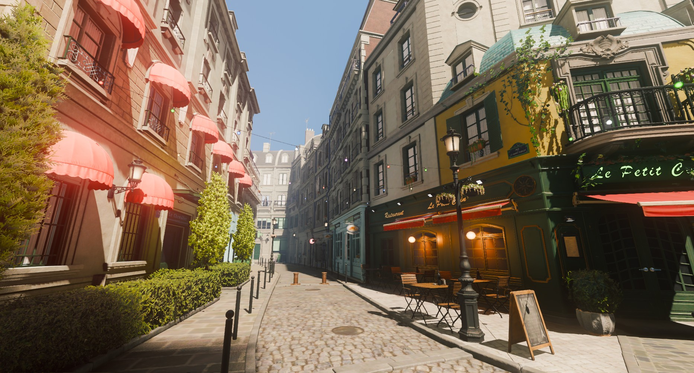
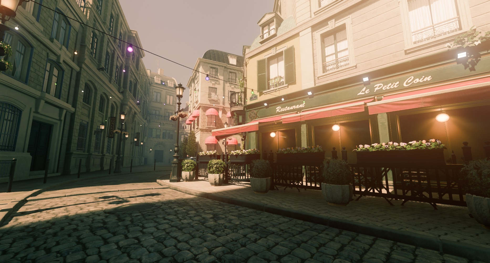
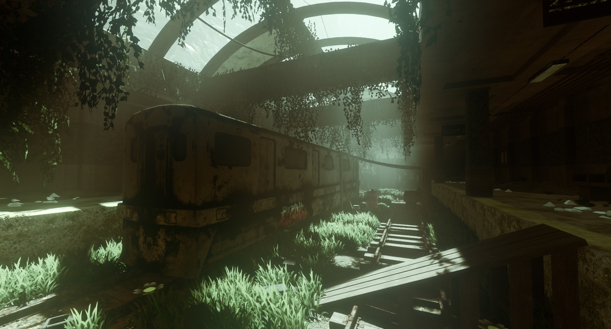
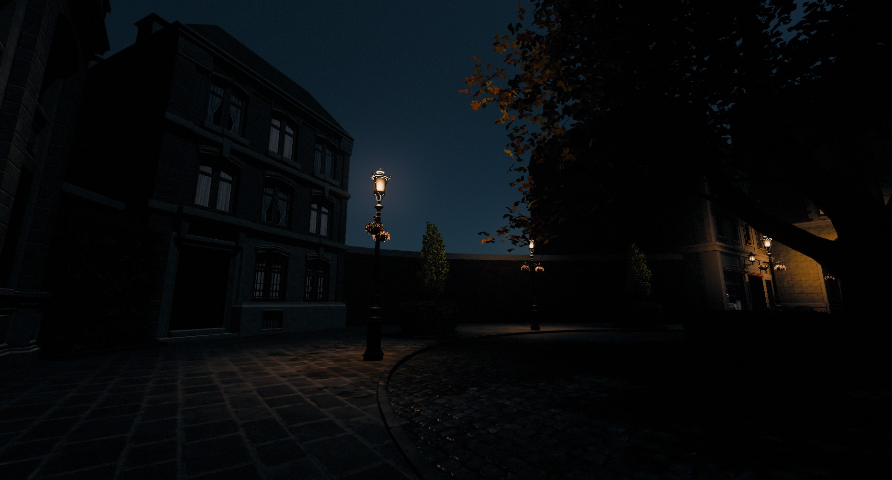

# Godot Color Grading
Flexible set of color filters utilizing dedicated color spaces.

Features:
- Shadows, midtones and highlights adjustment
- Color tint
- Vibrance
- Brightness
- Curves

## Night color
Simulation of color perception in darkness where your eyes are most sensitive to blue color while other colors appear darker.

## Local contrast
Enhance details and soft values of the scene with local contrast filter.

## Usage
Enable plugin in `Project settings -> Plugins -> Color grading`

Add new `Compositor` resource in your `WorldEnvironment` node if none is present.

Effects are available under `ColorGrading` and `LocalContrast` options.